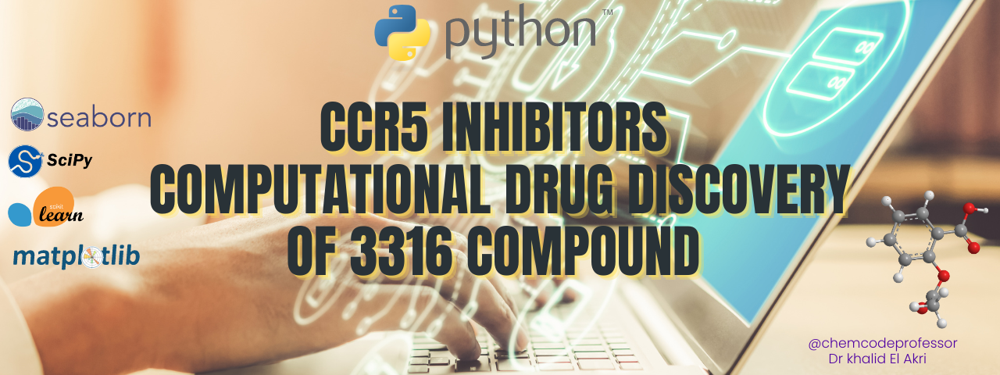
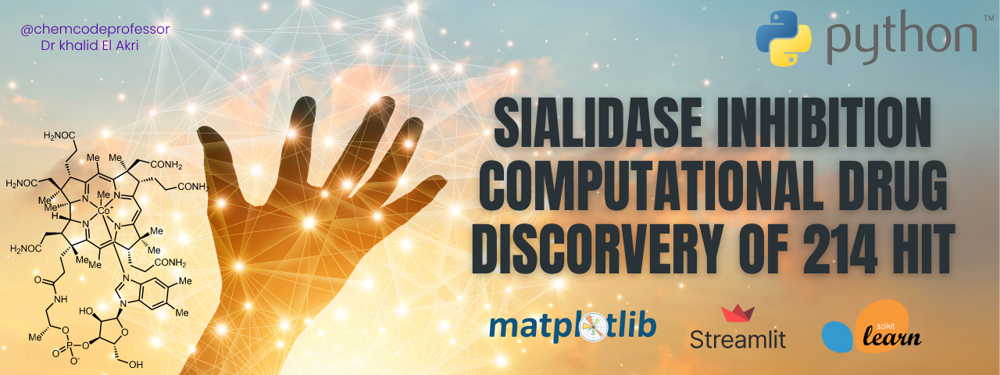
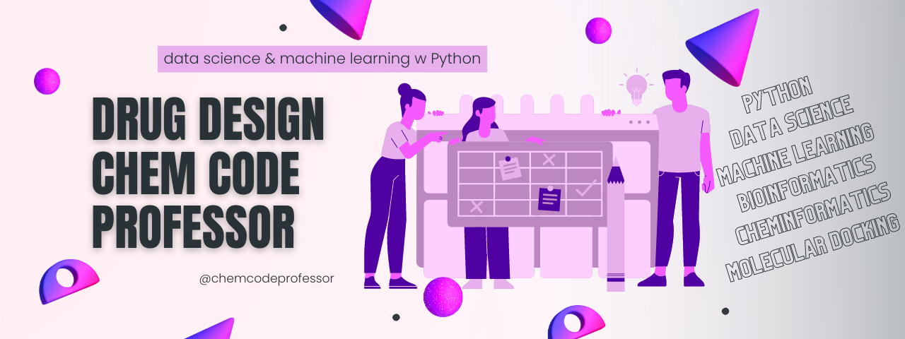

## Intro
Human Immunodeficiency Virus (HIV) is a major global health challenge, with millions of people infected and affected worldwide. Despite the availability of antiretroviral therapy, the emergence of drug resistance and the side effects of these drugs have limited their efficacy. Therefore, there is an urgent need for the development of new drugs with novel mechanisms of action. One such approach is to target the C-C chemokine receptor type 5 (CCR5), a co-receptor for HIV entry into host cells. In recent years, the design, synthesis, and characterization of new bioactive compounds as inhibitors of CCR5 have emerged as a promising strategy for the development of new antiretroviral agents.

## Intro
Inhibiting sialidase is important because sialidase is an enzyme that plays a crucial role in the life cycle of many viruses, including influenza virus. By inhibiting sialidase, the spread of the virus can be slowed or stopped. Additionally, sialidase is also involved in many other biological processes, such as cell signaling and the immune response. Inhibiting sialidase can therefore have potential therapeutic applications beyond antiviral treatments. The design, synthesis, and characterization of new bioactive compounds as inhibitors of sialidase have become an exciting area of research in drug development. Sialidases are a family of enzymes that play a crucial role in the pathogenesis of various diseases, including cancer, influenza, and bacterial infections. The inhibition of sialidase activity has emerged as a promising therapeutic strategy for the treatment of these diseases. In this postdoc article, we will discuss the use of computational methods, innovative synthetic routes, and advanced analytical techniques in the design, synthesis, and characterization of new bioactive compounds as inhibitors of sialidase.

## Biography
Dr. Khalid El Akri is an accomplished professor and researcher with a PhD in organic chemistry and drug design. With over 10 years of experience in academia, he has earned a reputation as one of the topest in his field. Dr. Akri published numerous scholarly papers and has delivered engaging lectures on the subjects of drug design, organic chemistry.

Dr. Akri's expertise extends beyond the classroom and laboratory. he was also an accomplished business development manager with a background in the medical equipment industry. Drawing on his unique set of skills and knowledge. 

As a well-rounded individual, Dr. Akri brings a unique perspective to his work and is able to bridge the gap between academia and industry. He is passionate about using his knowledge and expertise to make a positive impact on society and is dedicated to training the next generation of scientists and researchers.

<!--
**chemcodeprofessor/chemcodeprofessor** is a ✨ _special_ ✨ repository because its `README.md` (this file) appears on your GitHub profile.

Here are some ideas to get you started:

- 🔭 I’m currently working on ...
- 🌱 I’m currently learning ...
- 👯 I’m looking to collaborate on ...
- 🤔 I’m looking for help with ...
- 💬 Ask me about ...
- 📫 How to reach me: ...
- 😄 Pronouns: ...
- ⚡ Fun fact: ...
-->
